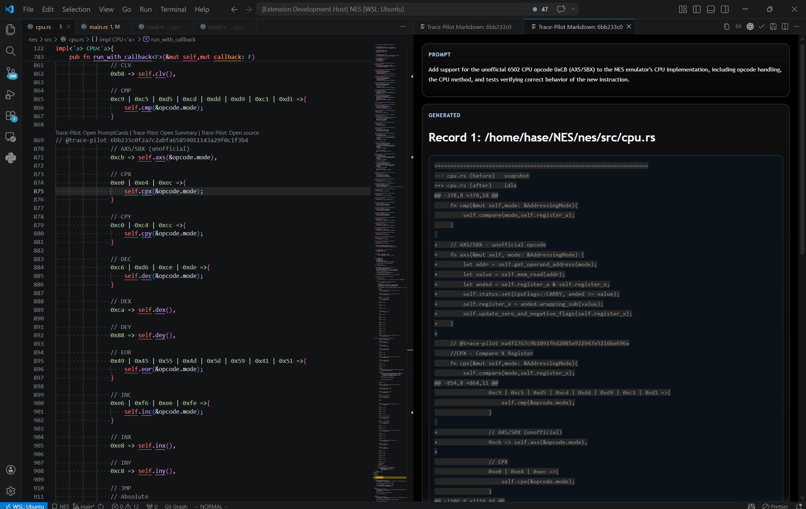
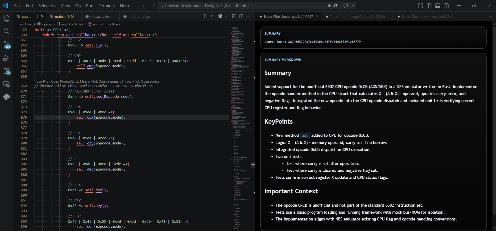

# Change Log
## [0.1.0] 
- released: 2026/04/01

## [1.1.0]
- released: 2026/04/21
* Implemented OpenSummary to support responses based on multiple interactions with the LLM.
* OpenSummary clarifies the intent of pasted text by summarizing the most recent three prompt-response pairs from the conversation history.
* This addresses cases such as prompts like "fix previous code", where the intent cannot be understood without prior context.
* When no recent prompt-response history is available, OpenSummary falls back to summarizing from the single prompt-response pair contained in the pasted text.

## [1.1.1]
- released: 2026/04/30
* Previously, when `.trace-worktree` did not exist, Trace Pilot created a branch and then created the worktree from it, so saving in the middle of a project also copied the branch's tracked files into `.trace-worktree`.
* Trace Pilot now creates `trace-store` as an orphan branch, so existing project files are not copied into `.trace-worktree` and only stored blobs are added there.

## [1.2.0]
- released: 2026/05/14
* Previously, clicking `guess prompt` only asked GPT-4 to infer the intent behind inserted code.
* Trace Pilot now stores the actual prompt-generated pair used by Codex for Codex-originated edits, along with the two immediately preceding pairs.
* Clicking the link now reveals the prompt-generated pair and the previous two pairs, making the intent behind Codex-assisted edits clearer.

## [1.2.1]
- released: 2026/05/26
* `guess prompt` now detects Codex edits that add new files, not only edits to existing files.
* Improved Codex edit detection by waiting a little longer for file changes to settle. This reduces cases where Codex-made changes were not recognized as Codex changes.
* Previous conversation context is now easier to read when opening ChatGPT or Codex sources. Context thread pairs are grouped by interaction and can be expanded or collapsed.
* `.intent-tracer` is now added to `.gitignore` by default, so Trace Pilot's local tracing data is not accidentally committed.

## [1.2.2]
- released: 2026/08/19
### Fixed
- Exclude Codex internal context blocks from stored user prompts.
