# trace-pilot

`trace-pilot` is a VS Code extension that preserves the provenance of copied text and code.

When text is copied in VS Code or captured by the Trace-Pilot Chrome extension, Trace-Pilot stores the original source data in a Git-backed repository and keeps a trace marker with the copied content. Later, inside VS Code, that marker can be resolved back to the original source so you can inspect where the content came from and recover its surrounding context.

This helps teams keep copied code and text explainable, auditable, and easier to maintain over time.

## Status

Trace-Pilot is published ver1.1.0

## Platform

Trace-Pilot is implemented as a VS Code extension and does not currently depend on Linux-specific features.

It has been used on Linux and Windows environments, as long as VS Code can execute `git` from the launched environment.

Notes:

- `git` must be installed and available on `PATH` for the VS Code process.
- Trace-Pilot uses `git worktree`, so that command must be available in your Git installation.
- Platform support has not been exhaustively validated on every environment, so edge cases may still exist.

## Related Project

The Chrome extension side of Trace-Pilot is provided as the companion project 
https://github.com/otinpan/trace-pilot-chrome

It captures content from the browser, stores source data, and passes trace markers that can later be resolved by this VS Code extension.

## What This Repository Contains

This repository contains the VS Code extension side of Trace-Pilot. Its responsibilities include:

- Capturing copied text from VS Code editors
- Storing the copied content and its source data in a Git-backed repository
- Resolving pasted trace markers back to their original source data
- Showing source content inside VS Code with highlighted copied regions
- Displaying Trace-Pilot links through CodeLens and hover actions
- Organizing prompt-and-output pairs as PromptCards
- Inferring likely prompts from file edits through the `guess prompt` workflow

## How to Push and Pull Trace-Pilot Resources
Trace-Pilot stores its data in the `.trace-worktree` worktree, checked out to the `trace-store` branch.

If you want to sync Trace-Pilot resources with `origin`, run the following commands from the repository root after `.trace-worktree` has been created.

### Push
```bash
git -C .trace-worktree push origin trace-store
```

### Pull
```bash
git -C .trace-worktree pull --ff-only origin trace-store
```

## Supported Sources

The VS Code extension currently works with source data from:

- VS Code text files
- PDF files opened in VS Code
- ChatGPT captures stored by `trace-pilot-chrome`
- Google Sheets captures stored by `trace-pilot-chrome`
- PDF pages captured by `trace-pilot-chrome`
- Static web pages captured by `trace-pilot-chrome`
- Prompt/output pairs generated from coding-agent-assisted edits

## How It Works

1. Copy text in VS Code, or copy content from Chrome using `trace-pilot-chrome`.
2. Trace-Pilot stores the copied text together with source data in a Git-backed repository.
3. A trace marker is kept with the copied content.
4. When the traced content appears in VS Code, Trace-Pilot detects the marker.
5. You can use hover links or CodeLens actions to open the original source.
6. Trace-Pilot restores the underlying content and highlights the copied region.
7. For prompt-based sources, you can also open PromptCards to inspect the prompt/output relationship.

## Main Features

Trace-Pilot adds commands to the editor title area in VS Code.

From left to right:

- `copy & store`
- `guess prompt`
- `save diff`
- `open PromptCards`
- `Summarize prompt-output pair`

### Copy And Store

When you copy selected text in a VS Code editor, Trace-Pilot stores both the copied text and its original source data in Git, then writes a trace marker back to the clipboard.

This works for normal text files as well as PDFs opened in VS Code.

#### Copy Text From A VS Code Editor

When you copy text from a file in VS Code, Trace-Pilot stores the copied selection together with the full source file.

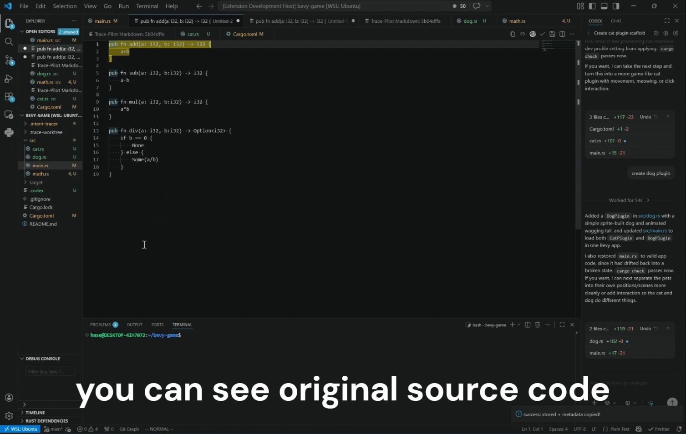

#### Copy Text From A PDF In VS Code

When you copy text while viewing a PDF in VS Code, Trace-Pilot stores the copied selection together with the original PDF data.

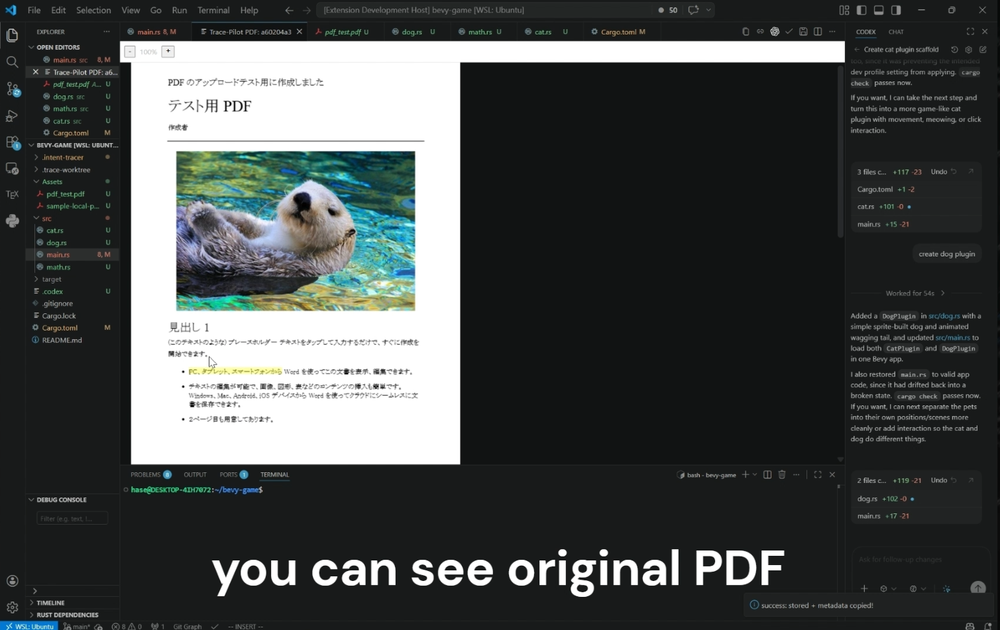

### Open Source

When Trace-Pilot markers are present in a file, VS Code shows CodeLens and hover actions such as `Open source`.

Selecting `Open source` restores the original source data and opens it in VS Code. Trace-Pilot highlights the portion that corresponds to the copied content so you can inspect the original context quickly.

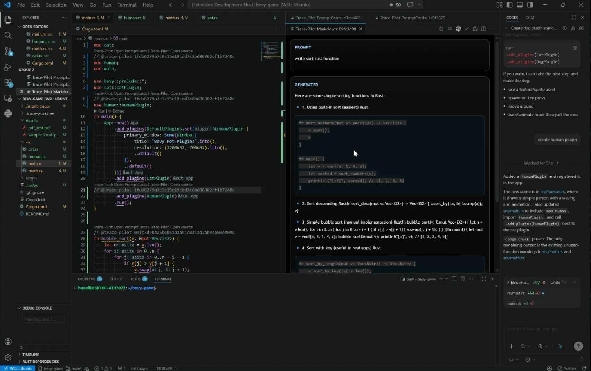

### Open PromptCards

For prompt-based sources such as ChatGPT captures and coding-agent traces, Trace-Pilot can show `PromptCards`.

PromptCards display stored prompt/output pairs from Git. You can browse the collected cards and open the related source data for each one.

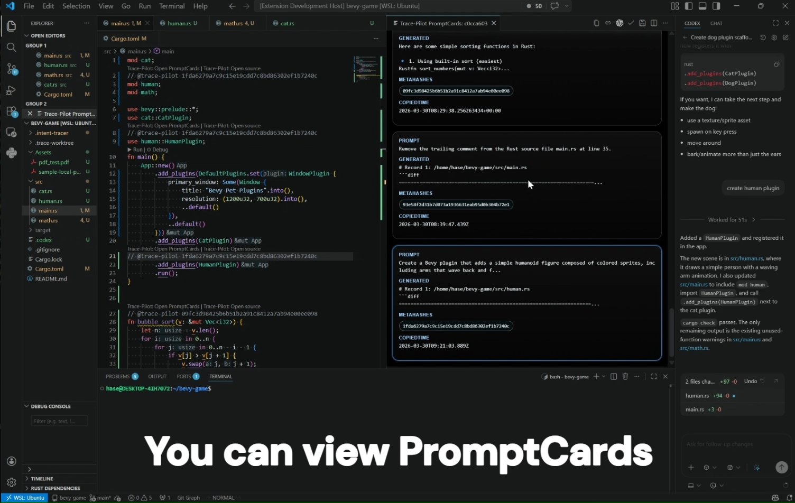

### Guess Prompt

After you modify files, clicking `guess prompt` uses the recorded diffs to infer a likely prompt behind the change. This is intended for AI-assisted coding workflows such as Codex or Claude Code.

Trace-Pilot also generates links for the changed locations so the inferred prompt can be inspected alongside the affected code.

This feature requires an OpenAI API key. You can set it from the Command Palette with `Trace Pilot: Set OpenAI API Key`. The key is stored in VS Code secret storage. If `OPENAI_API_KEY` is already set in the environment used to launch VS Code, Trace-Pilot will use that instead.

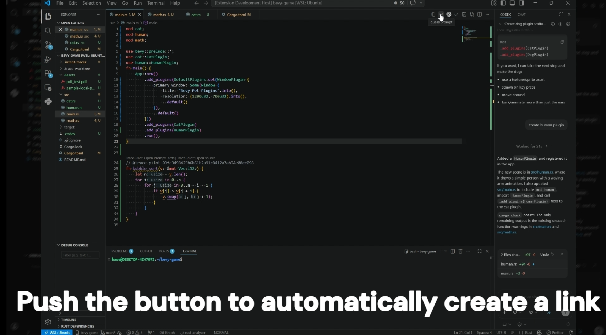
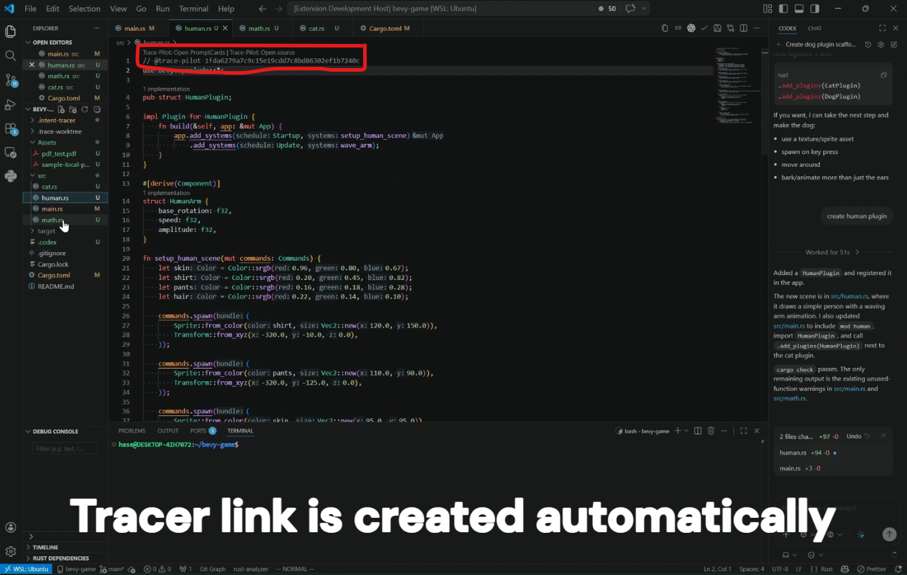
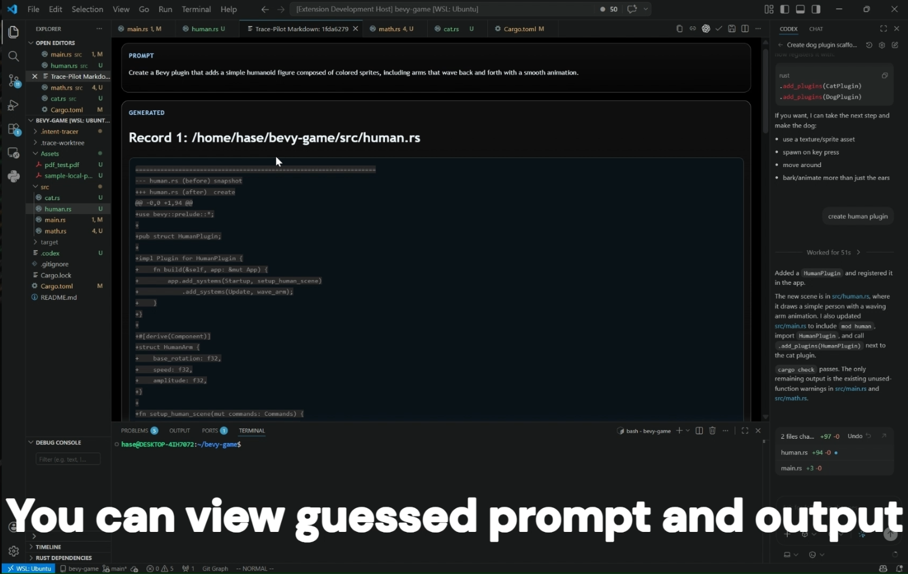

### Save Diff

Trace-Pilot watches file edits and can flush recorded diffs into its trace data using `save diff`.

This helps preserve the relationship between code changes and the prompts or actions that likely produced them.

### Summarize Prompt-Output pair
* Implemented OpenSummary to support responses based on multiple interactions with the LLM.
* OpenSummary clarifies the intent of pasted text by summarizing the most recent three prompt-response pairs from the conversation history.
* This addresses cases such as prompts like "fix previous code", where the intent cannot be understood without prior context.
* When no recent prompt-response history is available, OpenSummary falls back to summarizing from the single prompt-response pair contained in the pasted text.


## Why Use It

Copied text and code often lose their source context. Trace-Pilot helps preserve that context by storing:

- Where the text came from
- The original surrounding data
- A stable reference that can be resolved later
- Prompt/output relationships for AI-assisted work
- File diffs that help explain how a change was produced

It is also more resilient to link rot because the source data is preserved in your own Git repository rather than relying only on external URLs.

This is especially useful for:

- Research workflows
- Note-taking
- AI-assisted writing and coding
- Long-lived software projects
- Auditing generated or copied code

## Usage

Trace-Pilot has not been released yet, but the intended workflow is:

1. Copy text in VS Code or capture content from Chrome using `trace-pilot-chrome`.
2. Let Trace-Pilot store the source data in a Git-backed repository.
3. Paste or inspect traced content inside VS Code.
4. Use `Open source` to restore the original source and surrounding context.
5. Use `Open PromptCards` for prompt-based traces when available.
6. Use `guess prompt` and `save diff` to inspect AI-assisted edits.

## OpenAI API Key

`guess prompt` and PromptCard generation require an OpenAI API key.

To set it in VS Code:

1. Open the Command Palette.
2. Run `Trace Pilot: Set OpenAI API Key`.
3. Paste your API key into the input box.

The key is stored securely using VS Code secret storage.

If you prefer, you can also launch VS Code with `OPENAI_API_KEY` set in the environment. That environment variable takes precedence over the stored key.

## Features By Source

### VS Code Files

For normal files opened in VS Code, Trace-Pilot stores the selected text together with the full source file so the original context can be restored later.

### PDFs In VS Code

For PDFs opened in VS Code, Trace-Pilot stores the copied selection together with the original PDF and can reopen it with the copied region highlighted.

### ChatGPT

When trace data captured from ChatGPT by `trace-pilot-chrome` is opened in VS Code, Trace-Pilot can restore the prompt, generated output, and related PromptCards.

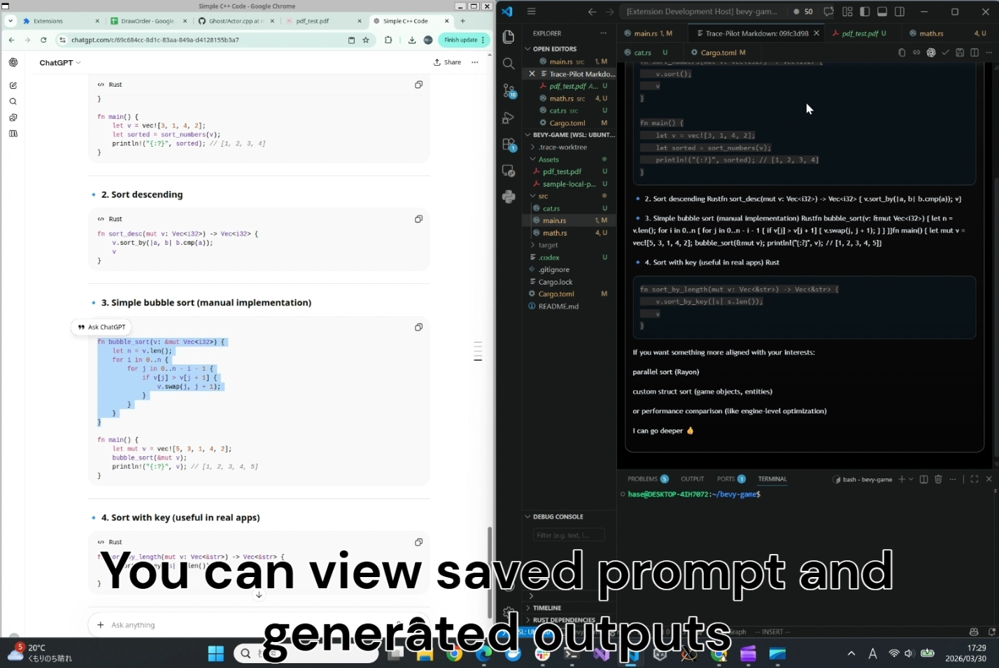

### Google Sheets

When trace data captured from Google Sheets by `trace-pilot-chrome` is opened in VS Code, Trace-Pilot can restore the selected cells together with the related sheet snapshot.

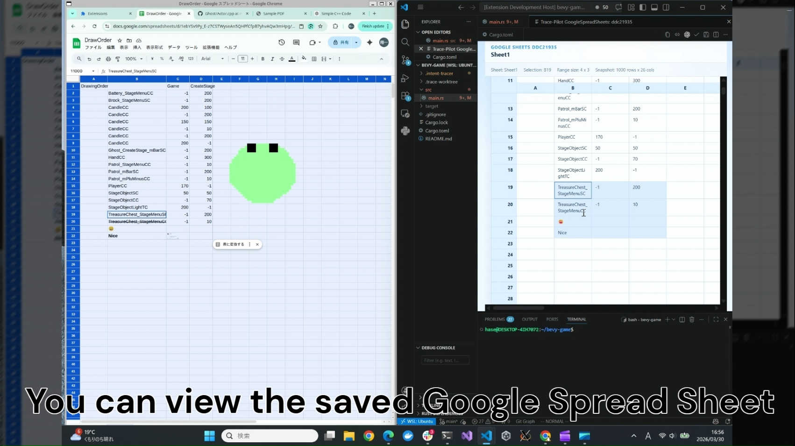

### Chrome PDFs

When trace data captured from PDFs in Chrome by `trace-pilot-chrome` is opened in VS Code, Trace-Pilot can restore the original PDF source and copied region.

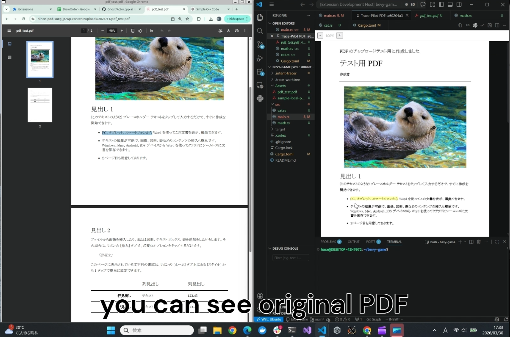

### Static Web Pages

When trace data captured from static web pages by `trace-pilot-chrome` is opened in VS Code, Trace-Pilot can restore the stored page data and highlight the copied selection.

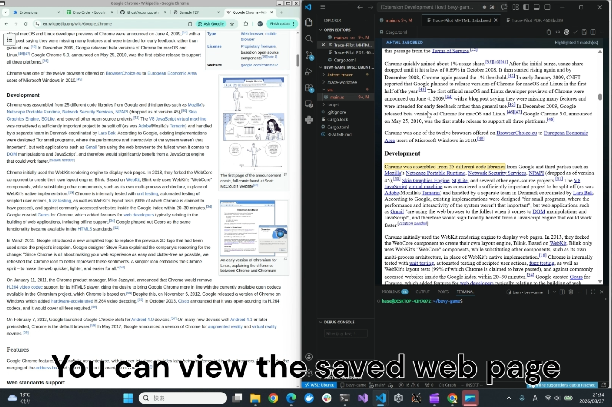

## Development

If you are working on the extension locally:

1. Install dependencies with `npm install`.
2. Build once with `npm run compile`.
3. Start watch mode with `npm run watch`.
4. Run tests with `npm test`.
